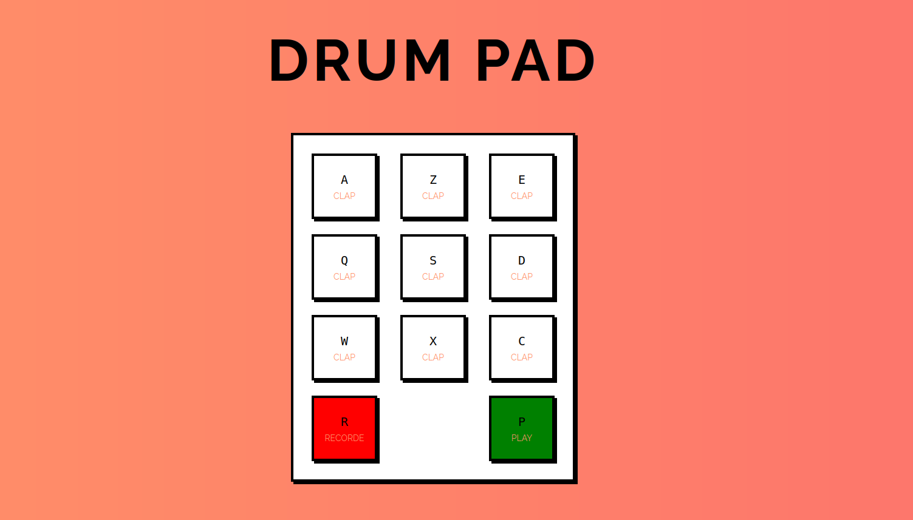

<h1>Drum-Box</h1> 

Drum-Box est un petit projet interactif développé en JavaScript. Il permet aux utilisateurs de jouer des sons de batterie en cliquant sur des boutons ou en appuyant sur des touches du clavier. C'est une façon amusante d'explorer les bases de l'interactivité en JavaScript.
 

<h2>🚀 Utilisation</h2> 

Pour utiliser Drum-Box, vous devez cloner le projet depuis ce dépôt. Suivez les étapes ci-dessous :
 
<ol> 
  <li>Clonez le dépôt : <code>git clone https://github.com/votre-utilisateur/drum-box.git</code></li> 
  <li>Ouvrez le fichier <code>index.html</code> dans votre navigateur pour commencer à jouer !</li> 
</ol>

<h2>🛠 Technologies utilisées</h2> 
<ul> 
  <li><strong>HTML5</strong> : Structure de la page</li> 
  <li><strong>CSS3</strong> : Mise en page et styles</li> 
  <li><strong>JavaScript</strong> : Logique interactive et gestion des événements</li> 
</ul> 

<h2>🎮 Fonctionnalités</h2> 
<ul> 
  <li>Jouer des sons de batterie en cliquant sur des boutons</li> 
  <li>Jouer des sons en appuyant sur des touches du clavier</li> 
  <li>Effets visuels pour une expérience utilisateur agréable</li> 
</ul> 

<h2>📷 Aperçu</h2>
</img>
